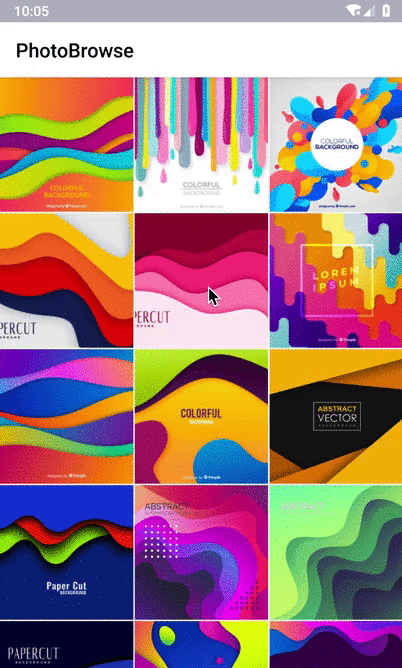

# PhotoBrowse - Android
PhotoBrowse is an Android photo browser that supports dragging off

## Preview

| Photo Click | Photo Drag  |
| ------------- | ------------- |
|   |   |


## Features

- Basic photo browsing
- Click to close the photo
- Drag to close the photo


## Installation 

### Requirements 

- Android SDK Version 21 
- Java Development language

## Usage

```java 
if (Build.VERSION.SDK_INT >= 22) {
        ActivityOptionsCompat compat = ActivityOptionsCompat.makeSceneTransitionAnimation(this, imageView, photoPathList.get(position));
        startActivity(intent, compat.toBundle());
}else {
    startActivity(intent);
}
```

## Author
<a src="https://github.com/weifans">
    
</a>


Does your organization or project use PhotoBrowse? Please let me know by email.

- weifans, duanhaisi@gmail.com
- SLEEP WIND https://sleepwind.com

## License 

PhotoBrowse is available under the MIT license. See the LICENSE file for more info.
